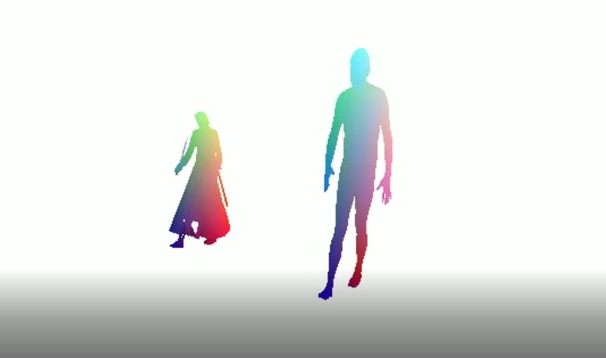
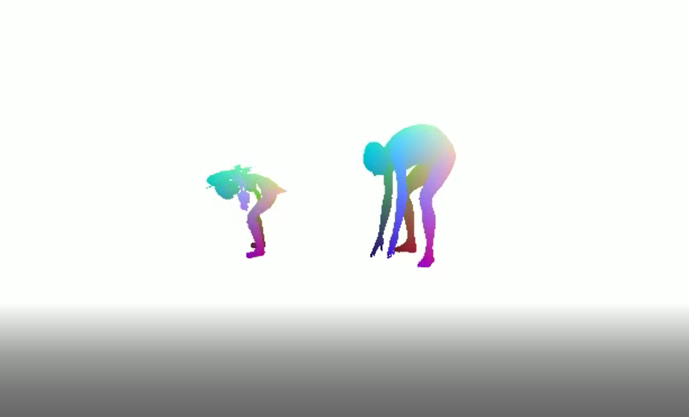

# Pose2Carton 

EE228 课程大作业 利用3D骨架控制3D卡通人物 (https://github.com/yuzhenbo/pose2carton) 

数据组别： 13

数据类型： 20组匹配

# Maya 环境配置

配置mayapy执行环境的关键步骤有两个：

(1)将maya添加到PATH环境变量。

(2)在mayapy内安装pip包管理和numpy科学计算库。

Maya 2020内置的mayapy是Python2.7版本，\textbf{不自带pip}，但是手动安装是不费力的。

Mayapy使用的Python2.7\textbf{并非通用的CPython实现}，需要手动打包一个符合标准的numpy库。在多方查询资料之后，我们选择了下面的一套方案：

- 下载一个版本的numpy的源码。

- 在官网获取Maya 2020的devikit包。

- 获取Maya 2020对应的Visual Studio开发工具(2015版)

- 手动编译numpy库。

# 匹配流程

(1)transfer.py的使用

挑选一个助教提供的模型，transfer_given_pose模块会在输出中显示该模型的各个关节点的编号以及关节之间的父子关系。接下来要进行的工作就是在字段manual_model_to_smpl中补充我们认为的正确关节点匹配。匹配关节点的一个有效方法是根据模型内关节点的名称对应到人体模型的各个关节上。

具体来说，transfer.py文件本身就包含直接根据名称匹配对应的关节点的函数，同时还会输出模型当中包含的关节点的序号和名称，通常而言这些名称都是人体关节的名字，这样我们不用使用其它软件打开模型就能够明白对应序号的关节的位置和意义。在实际匹配的工作中，绝大多数模型的匹配都是直接根据名称来对应的，大部分模型使用英文名标记各个关节点。有一部分模型的标记使用了日文罗马音/无意义可寻的数字，在第一部分中避开了这些模型。对于这种不能通过简单名称匹配的模型的解决方案会在第二部分提及。transfer.py中的模块_lazy_get_model_to_smpl可以大幅减少工作。

(2)vis.py的使用

可视化过程中主要使用的脚本是vis.py。在完成了动作匹配之后，由于本项目很难量化匹配结果的好坏，需要使用vis.py来实现匹配结果的可视化。

可视化部分不仅是项目结果的一个展示，同时也是项目过程中修正的一个有力工具。这个脚本的作用是针对每一个动作生成一张匹配结果的对比图，因为提供的动作是一段连续动作的采样，将这些图片一帧一帧播放后保存为视频（mp4格式）就得到了模型做相同的一系列动作的效果，接下来需要人为地观察模型匹配的结果是否与原本人体做出的动作一致。如果不一致，那么回到动作匹配部分进行关节点的重新匹配/增加匹配。两部分的可视化步骤基本一致，直接运行脚本

# 项目结果

# 协议 
本项目在 Apache-2.0 协议下开源

所涉及代码及数据的所有权以及最终解释权归倪冰冰老师课题组所有. 
